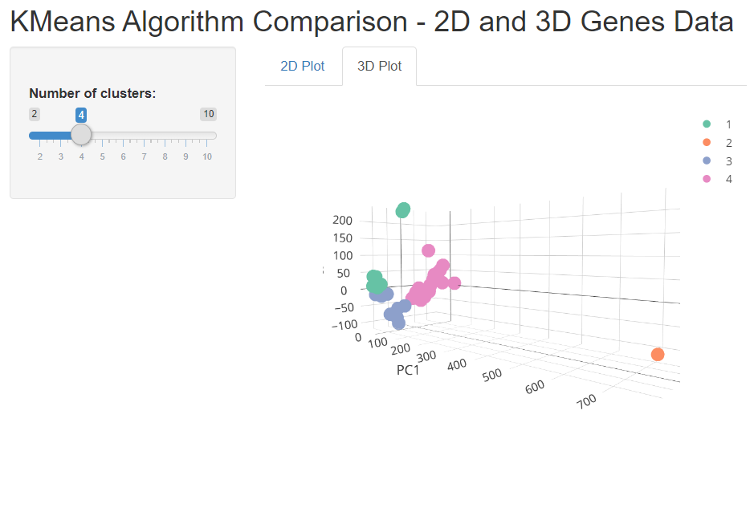

# K-means-shiny-app
A small project I created to illustrate the K-means algorithm (classification), interactively. You can change K to see the effect of the data tagging and watch it in 2D or 3D.

You can see the full project here: https://liav.shinyapps.io/kmeans_pca/

